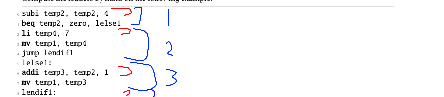

# MiniC Compiler
LAB5 (smart code generation), MIF08 / CAP / CS444 2022-23 

# Authors

MONCORGE - LEPRAT

# Contents

SmartAllocator.py implements a smart register allocator for MiniC. Unlike the naive allocator, it tries to minimize the number of register spills by using the Sethi-Ullman algorithm as described in the course. We also have a CFG.py file that is used to compute the control flow graph of a function, using the Kempe algorithm in order to color the graph.

LivenessDataflow.py is used by SmartAllocator.py to compute the liveness information for each basic block.

# Howto
python3.10 MiniCC.py --mode codegen-cfg --reg-alloc naive --graphs TP04/tests/provided/dataflow/df02.c
To compile and run a program:
```
$ python3 ./MiniCC.py --reg-alloc=smart TP04/tests/provided/step1/test00.c
Code will be generated in file TP04/tests/provided/step1/test00.s
$ riscv64-unknown-elf-gcc TP04/tests/provided/step1/test00.s ../TP01/riscv/libprint.s -o /tmp/a.out
$ spike pk /tmp/a.outv
```


To launch the testsuite:
```
make test-smart
```

# Test design

We designed tests in order to have a good cover, we have tests for the allocation of multiple variables, reallocation of variables, and the allocation of variables in different blocks.

# Design choices

We followed the current design and implemented everything needed to be implemented.

# Known bugs

No known bugs.

