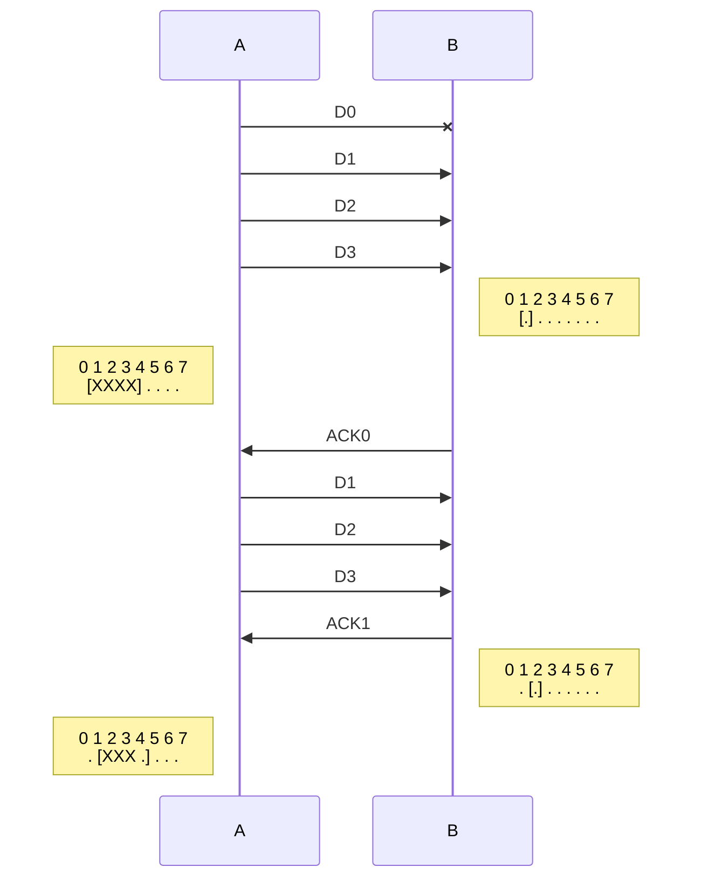
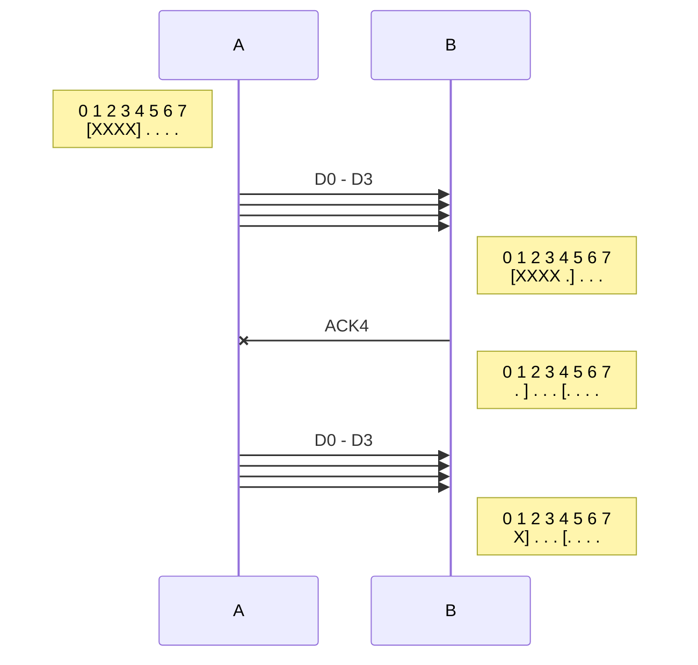
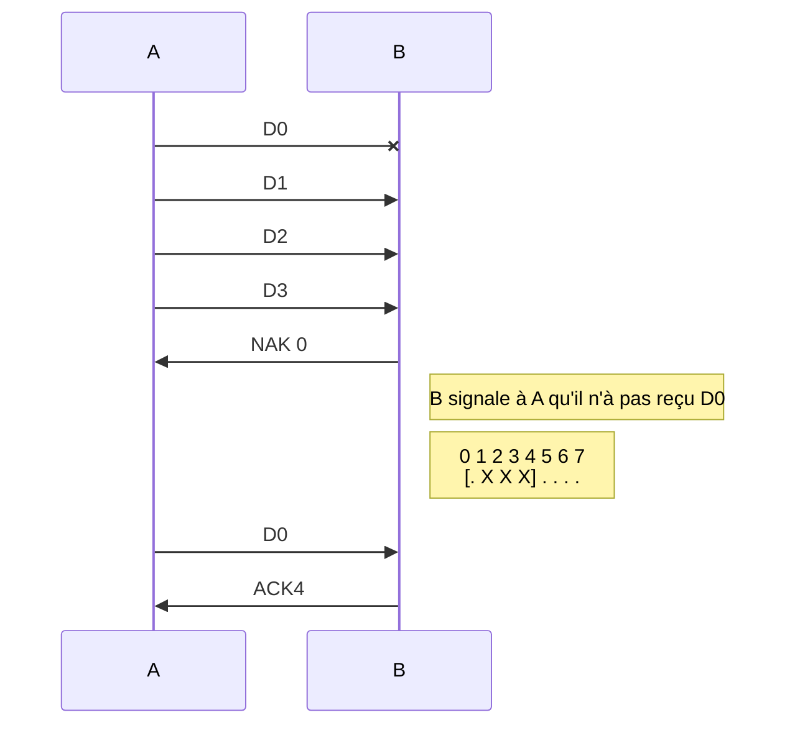

# Intro

La simulation se lance avec : 
**./swp durée tauxdeperte tauxderreurs trace duplex**
où les paramètres sont les suivants : 
**durée**: durée de la simulation en top d'horloges
**tauxdeperte**: pourcentage de trames perdues, entre 0 et 99
**tauxderreurs** pourcentage de trames reçues avec une erreur détectée trace
**ndrapeaux** pour tracer les événements (1 = émissions, 2 = réceptions, 4 = expirations, 8 = résumés périodiques)
**duplex** 0 pour une communication simplex 
On conseille d'utiliser la valeur 7 (1+2+4) pour trace.


## 2) Fenêtres et Tampons

**2.1**
<strong><u> FAIRE SCHÉMA DUPLEX IMPORTANT LÀ</u></strong>

**2.2** **swp 700 25 0 7 0** => erreur au tick 517.
Le problème est que le réceptionneur peut décaler sa fenêtre et recevoir un paquet ancien à un nouvel emplacement. SWS est supérieur à NSEQ/2 donc il y a recouvrement "en  arrière" par la fenêtre d'émission.
**2.3** Si *SWS*=3 alors *SWS*<*NSEQ*/2 donc il ne peut pas y avoir de rebouclement.
<strong><u> FAIRE SCHÉMA IMPORTANT LÀ</u></strong>

## 3)  Performances
**3.1 /** <u>Cas SWS > RWS (RWS = 1) :</u>
Dans le cas où la taille de la fenêtre d'émission (TFE) est plus grande que la taille de la fenêtre de réception (TFR) (respectivement SWS et RWS), il est possible que des trames soient retransmis pour rien, amenant ainsi a une baisse de de l'efficacité. En effet, soit la situation suivante : 

Dans cette situation, les trames D1,D2,D3 sont reçus mais ignoré, malgré les retransmissions. Ce sont des retransmissions inutiles. Il est donc plus avantageux d'avoir des tailles de fenêtres égales et (comme on l'a vu précédemment) inférieur à NSEQ/2 pour éviter ces retransmissions inutiles-là.

<u>Cas RWS > SWS :</u>

Comme le montre la situation suivante, dans le cas où la fenêtre de réception est plus grande que celle d'émission, tout en ayant RWS+SWS > NSEQ, on se retrouve dans un nouveau cas de chevauchement : des trames sont acceptées et sauvegardées alors qu'elles ne sont pas censées l'être.
Si RWS + SWS <= NSEQ, alors il n'y aura pas de chavauchement, la fenêtre de réception ne sera juste jamais remplie (l'émetteur ne peut envoyé plus de trames que le permet sa fenêtre).

**3.2 /**
Èvaluons l'impact de la taille de la fenêtre de réception sur les performances. Ci-dessous se trouve un tableau qui, en foncion de RWS et du taux de perte de trame, donne l'efficacité du protocole.

*Efficacité en fonction de la taille de la fenêtre et du taux de perte.*
|RWS\tdp|0|2|4|6|8|10|12|15|20|
|--|--|--|--|--|--|--|--|--|--|
|1|100|47|46|44|40|38|37|35|34|
|2|100|62|60|56|53|50|49|45|41|
|3|100|78|74|70|64|61|60|55|49|
|4|100|93|86|82|77|72|68|63|54|


Ce dernier a été généré avec le script suivant (au format markdown) :
```
#!/bin/bash

log=$1
longueur=50000
echo "|RWS\tdp|0|2|4|6|8|10|12|15|20|" > $log
echo "|--|--|--|--|--|--|--|--|--|--|" > $log

for RWS in 1 2 3 4; do
	
	echo -n "|$RWS|" >> $log
	sed "s/RWS [0-9]/RWS $RWS/" -i swp.c
	make

	for tdp in 0 2 4 6 8 10  12 15 20; do
		./swp $longueur $tdp 0 7 0 >> /dev/null
		echo -n "$?|" >> $log
	done
	echo "" >> $log
done
```
Traçons maintenant les courbes de l'efficacité avec les valeurs du tableau (le script suivant nous aidera à le faire). *Le fichier graph.plt est fourni avec les différents fichiers du TP.*
```
#!/bin/bash

longueur=50000
sed -i '/plot.*/cplot "log1" w lp title "RWS1", "log2" w lp title "RWS2", "log3" w lp title "RWS3", "log4" w lp title "RWS4"' graph.plt

for RWS in 1 2 3 4; do
	echo "# RWS=$RWS"
	sed "s/RWS [0-9]/RWS $RWS/" -i swp.c
	make >> /dev/null
	for tdp in 0 2 4 6 8 10  12 15 20; do
		echo -n "$tdp " >> "log$RWS"
		./swp $longueur $tdp 0 7 0 >> /dev/null
		echo "$?" >> "log$RWS"
	done
done

gnuplot graph.plt
```
<br/>Nous pouvons en déduire plusieurs choses. Déjà, quelque soit la taille de la fenêtre de réception, l'efficacité est au maximum si le taux de perte est nul. C'est un résultat logique puisque l'absence garantie de perte de trame rend le protocole à fenêtre glissante obsolète. Les observations deviennent plus intéressantes dés l'apparition de pertes de trames. Bien que quelque soit RWS, l'efficacité suit une tendance décroissante en fonction de la croissance du taux de perte. Il y a tout de même une différence notable d'intensité. Plus la fenêtre est grande, plus l'efficacité est haute, venant du fait qu'il y ait moins de perte.
Nous pouvons conclure de ces observations que plus la taille de la fenêtre est grande, moins il y aura de perte, et moins l'efficacité décroît avec un taux de perte élevé.

**3.3 /**


## 4) Le bug

En testant le code vu en cours avec le simulateur en mode simplex, on s'aperçoit qu'à partir du moment ou un *ACK* se perd, plus aucun *ACK* n'est envoyé, la communication n'avance donc plus.


## 5) Modication

**5.1** L'ajout du NAK permet à l'émetteur de renvoyer moins de trames. 
Exemple UML

**5.1** Modification du protocole

Le NAK est utile pour renvoyer moins de trames. En effet dès que le récepteur s'aperçoit qu'il n'a pas reçu une trame il renvoie un NAK pour signaler à l'émetteur ce manque.
L'émetteur peut ensuite ajuster sa fenêtre et renvoyer les paquets nécessaires.

**5.2** Modification du code source


